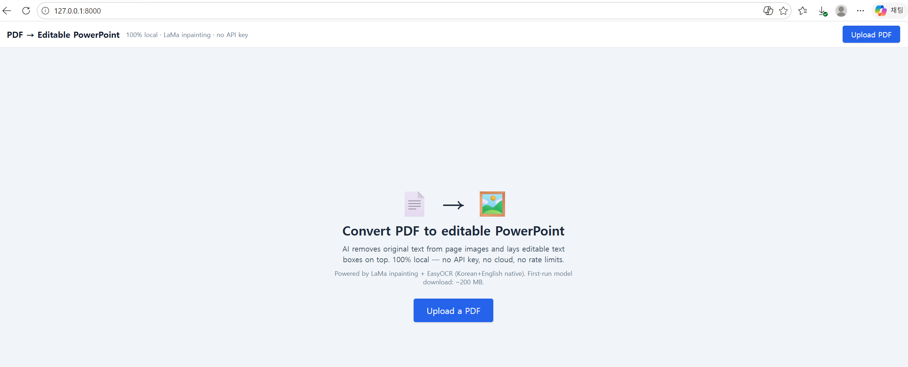
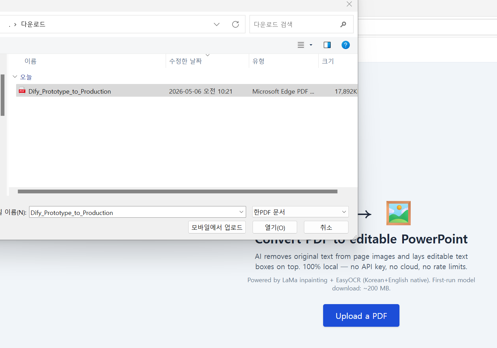
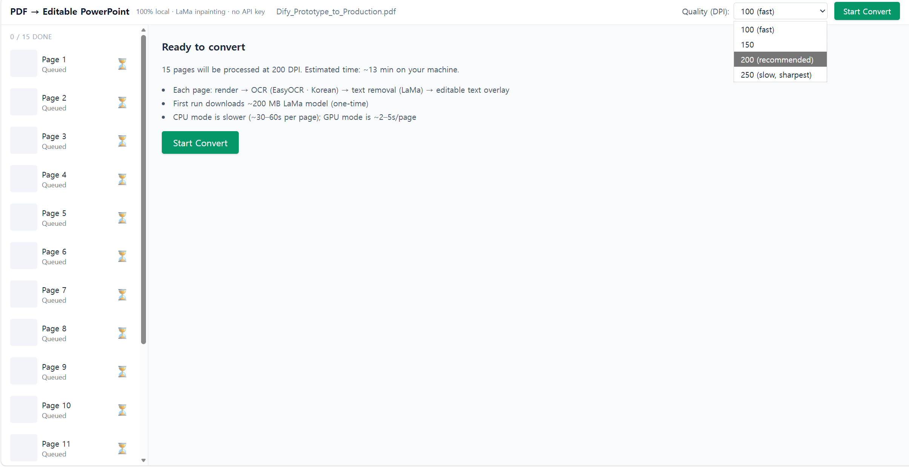
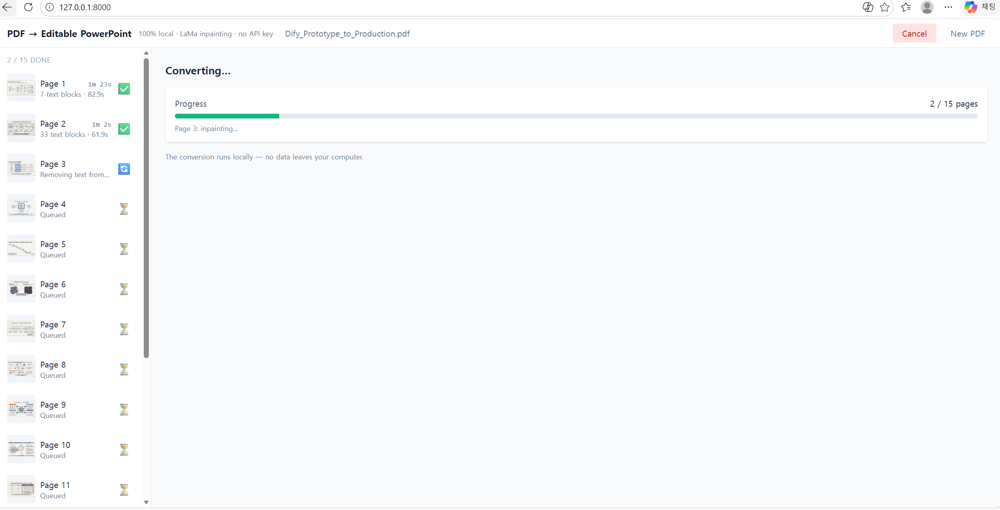

# 사용법

> 설치가 아직이라면 [install.md](install.md) 먼저.

---

## 1. 앱 실행

설치가 끝났으면, 다음 두 가지 중 한 가지로 실행:

### A. 가장 쉬움 — `start.bat` 더블클릭
파일 탐색기로 프로젝트 폴더 열고 `start.bat` 더블클릭. 까만 창과 함께 브라우저가 자동으로 `http://127.0.0.1:8000` 으로 열립니다.

### B. cmd로 실행
```cmd
cd /d D:\00work\260506-LaMa-pdf2editablePowerpoint
.venv\Scripts\activate
python app.py
```

> 끝낼 때는 까만 창에서 **`Ctrl+C`** 또는 창 닫기.

> 

---

## 2. PDF 업로드

화면 가운데의 **Choose PDF** 버튼을 누르거나, PDF 파일을 영역 위로 **드래그&드롭**.

> 

업로드되면 페이지별 썸네일과 페이지 수가 표시됩니다.

---

## 3. DPI 선택

DPI가 높을수록 OCR 정확도와 인페인팅 품질이 올라가지만, 느려지고 메모리를 더 씁니다.

| DPI | 속도 | 품질 | 권장 |
|---|:---:|:---:|---|
| 150 | 빠름 | 평범 | 텍스트가 큰 슬라이드, 빠른 미리보기 |
| **200** | 보통 | 좋음 | **기본값 — 대부분의 문서** |
| 300 | 느림 | 최고 | 작은 글씨가 많은 학술 PDF, 인쇄용 |

> 

---

## 4. 변환 시작

**`Start Convert`** 버튼 클릭.

> 

페이지마다 다음을 화면 우측에 표시합니다:
1. 페이지 렌더링
2. OCR (텍스트 검출)
3. LaMa 인페인팅 (텍스트 영역만 깨끗이 지움)
4. PPTX 슬라이드 생성

**예상 시간**: CPU 모드는 페이지당 30–60초 (200 DPI 기준). 10페이지면 약 5–10분.
GPU 모드는 페이지당 2–5초.

처음 한 번만 LaMa 모델 가중치(~200 MB)를 자동 다운받으므로 첫 페이지가 좀 오래 걸립니다.

---

## 5. (선택) 브라우저에서 다듬기

변환이 끝나면 자동으로 **Review 화면**이 열립니다. 페이지별로:

- **텍스트박스 드래그/리사이즈** — 위치·크기 수정
- **브러시 도구** — OCR이 놓친 영역에 마스크를 그리고 **Commit region** 누르면 그 부분만 추가로 LaMa 인페인팅 + 빈 텍스트박스 생성
- **박스 삭제** — 원치 않는 텍스트박스 제거
- **OCR-on-region** — 특정 영역에 대해 OCR 재실행

> 

수정이 끝났으면 **Re-export**.

이 단계를 건너뛰고 바로 6단계로 가도 됩니다.

---

## 6. PPTX 다운로드

**`Download .pptx`** 버튼 클릭. 파일이 다운로드 폴더에 저장됩니다.

> 

PowerPoint에서 열어보면 모든 텍스트가 **클릭으로 편집 가능한 텍스트박스**로 들어가 있습니다. 폰트·크기·색상도 PowerPoint 기본 도구로 자유롭게 수정 가능.

> 

---

## 자주 막히는 문제

### "변환은 끝났는데 PowerPoint에서 텍스트가 이미지 위에 박혀있다"
일부 페이지가 OCR로 검출이 안 됐을 가능성이 큽니다. **5단계 Review 모드**에서 브러시로 누락 영역을 칠하고 `Commit region`을 여러 번 적용하세요.

### "텍스트 위치가 살짝 어긋나 있다"
LaMa는 텍스트를 지우지만 OCR이 제공한 bbox 위치 그대로 텍스트박스를 얹기 때문에, OCR bbox가 살짝 작거나 크면 위치가 어긋날 수 있습니다. PowerPoint에서 직접 끌어 옮기거나 5단계에서 박스를 드래그로 미세조정하세요.

### "변환이 너무 느리다"
- DPI를 200 → 150으로 낮추기
- NVIDIA GPU가 있으면 [install.md "GPU 가속"](install.md#gpu-가속-선택) 따라 GPU torch 설치
- 페이지 수가 많은 PDF는 분할해서 변환

### "메모리가 부족해서 멈춘다"
- DPI 낮추기 (300 → 200)
- 다른 무거운 프로그램 종료
- 한 번에 처리하는 페이지 수를 줄이기 위해 PDF를 분할

### "한국어가 깨져 나온다"
EasyOCR(`langs=['ko','en']`)은 한·영을 동시에 인식하므로 일반적으로 잘 됩니다. 깨지는 경우는 보통:
- PDF의 폰트가 매우 특이하거나 디자인 폰트
- DPI가 너무 낮아서 OCR이 한글 자모를 분리해서 인식

DPI 250–300으로 올리고 다시 시도해보세요.

### "PowerPoint에서 텍스트박스가 슬라이드 밖으로 튀어나간다"
DPI에 따라 OCR bbox 좌표가 달라지면서 텍스트박스 크기 추정이 어긋난 경우입니다. PowerPoint에서 박스를 선택해 직접 줄이거나, 5단계 Review에서 박스 크기를 조정하세요.
